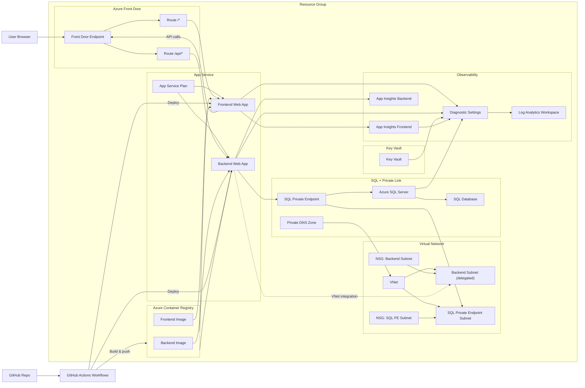

# Architecture Overview

## High-Level 3-Tier Architecture

```mermaid
flowchart LR
    User[User Browser]
    GitHub[GitHub Repo]
    Actions[GitHub Actions Workflows]

    subgraph RG["Resource Group"]
        subgraph FD["Azure Front Door"]
            FDEndpoint[Front Door Endpoint]
            FDRouteWeb["Route /*"]
            FDRouteApi["Route /api/*"]
            FDEndpoint --> FDRouteWeb
            FDEndpoint --> FDRouteApi
        end

        subgraph AppSvc["App Service"]
            Plan[App Service Plan]
            FEApp[Frontend Web App]
            BEApp[Backend Web App]
            Plan --> FEApp
            Plan --> BEApp
        end

        subgraph Network["Virtual Network"]
            VNet[VNet]
            SubnetApp["Backend Subnet (delegated)"]
            SubnetPE["SQL Private Endpoint Subnet"]
            NSGApp[NSG: Backend Subnet]
            NSGPE[NSG: SQL PE Subnet]
            VNet --> SubnetApp
            VNet --> SubnetPE
            NSGApp --> SubnetApp
            NSGPE --> SubnetPE
        end

        subgraph Data["SQL + Private Link"]
            SqlServer[Azure SQL Server]
            SqlDb[SQL Database]
            SqlPE[SQL Private Endpoint]
            PrivateDNS["Private DNS Zone"]
            SqlServer --> SqlDb
            SqlPE --> SqlServer
            PrivateDNS --> VNet
        end

        subgraph ACR["Azure Container Registry"]
            FEImage[Frontend Image]
            BEImage[Backend Image]
        end

        subgraph KV["Key Vault"]
            KeyVault[Key Vault]
        end

        subgraph Obs["Observability"]
            LAW[Log Analytics Workspace]
            AIFe[App Insights Frontend]
            AIBE[App Insights Backend]
            Diag[Diagnostic Settings]
        end
    end

    User --> FDEndpoint
    FDRouteWeb --> FEApp
    FDRouteApi --> BEApp
    FEApp -->|API calls| FDEndpoint

    BEApp --> SqlPE
    BEApp -. VNet integration .-> SubnetApp
    SqlPE --> SubnetPE

    FEImage --> FEApp
    BEImage --> BEApp
    ACR --> FEApp
    ACR --> BEApp

    GitHub --> Actions
    Actions -->|Build & push| ACR
    Actions -->|Deploy| FEApp
    Actions -->|Deploy| BEApp

    FEApp --> AIFe
    BEApp --> AIBE

    FEApp --> Diag
    BEApp --> Diag
    SqlServer --> Diag
    KeyVault --> Diag
    AIFe --> Diag
    Diag --> LAW
```
